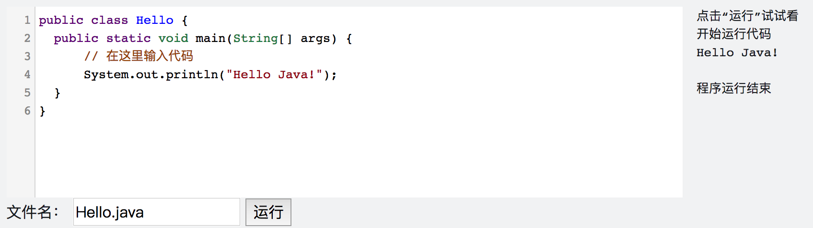

<notice>教程读者请不要直接阅读本文件，因为诸多功能在此无法正常使用，请移步至[程谱 coderecipe.cn](https://coderecipe.cn/learn/2)学习完整教程。如果您喜欢我们的教程，请在右上角给我们一个“Star”，谢谢您的支持！</notice>
初入Java编程
======

欢迎来到程谱社区！😁 我们是一群留学生，致力于搭建一个系统而又不枯燥的零基础入门编程学习平台。希望大家能多多支持我们，如果发现我们的不足之处也欢迎联系我们~

从这里开始学习吧！💖

输入输出
------
对于计算机程序的运行来说，我们先给程序提供必要的数据信息（输入），然后程序进行一系列的运算，再把结果告诉我们（输出），就像下面这张图画的这样：


在AP里，如果出现输入则会特殊说明，输出用的则是`System.out.println`，如果我们想输出`Hello Java!`，则可以使用如下的语句：

```java
System.out.println("Hello Java!");
```

上面的语句中的一对双引号意味着我们要原样输出引号之间的内容，整个语句的意思是要输出`Hello Java!`**并且** 换行，这里的`"Hello Java!"`有一个名字，叫字符串(String)，最后的分号说明这条语句结束了，把这条语句和其他内容分隔开来。当然我们也可以使用不换行的版本：
```java
System.out.print("Hello Java!");
```

不过如果使用这个语句的话，上一次和下一次输出的内容就会混在一起了，因此AP中主要使用的还是`System.out.println`。

下面是练习框，让我们跟着练习框的下方的指示一起来熟悉一下练习环境吧。

<lab lang="java" parameters="filename=Hello.java">
<notice>练习环境在此无法显示，请移步至[程谱 coderecipe.cn](https://coderecipe.cn/learn/2)查看。</notice>
public class Hello {
  public static void main(String[] args) {
      // 在这里输入代码
  }
}
</lab>

让我们在`// 在这里输入代码`后面另起一行，输入：
```java
System.out.println("Hello Java!");
```
之后点击“运行”按钮。

结果应该是这样：


细心的你可能会发现我们的练习操作台上有“文件名”一栏，填的是“Hello.java”，这是因为在Java里，文件名需要和类名一致，之后我们会讲到类的概念，到时候你就明白这是为什么啦。

这样，我们就做出了一个小程序，它能做出最基本的输出功能，是不是很有意思呀~

掌握了吗？如果掌握了，就按一下右下方这个按钮吧~

转义
------
如果是输出简单的文字，那上面的知识已经足够了，但如果是要输出一些特殊的文字，比如`"`，直接放入引号内可就不行了，我们可以试一试：

<lab lang="java" parameters="filename=Hello.java">
<notice>练习环境在此无法显示，请移步至[程谱 coderecipe.cn](https://coderecipe.cn/learn/2)查看。</notice>
public class Hello {
  public static void main(String[] args) {
      // 在这里输入代码
      System.out.println(""");
  }
}
</lab>

运行之后我们会发现错误是`Hello.java:5: error: unclosed string literal`，这其实想告诉我们的是，Java认为我们前面的一对`""`是一对双引号，双引号间的内容就是我们要输出的文字，而后面的`"`落单了，Java找不到匹配的双引号。因此我们要让Java知道我们的第二个双引号是要用来原样输出而不是当做字符串结束的。在Java里面，我们可以在"前面加一个`\`来告诉Java，方式如下：

<lab lang="java" parameters="filename=Hello.java">
<notice>练习环境在此无法显示，请移步至[程谱 coderecipe.cn](https://coderecipe.cn/learn/2)查看。</notice>
public class Hello {
  public static void main(String[] args) {
      // 在这里输入代码
      System.out.println("\"");
  }
}
</lab>

这样就可以成功输入一个双引号了。在这里，我们涉及了一个概念，叫做**转义**(escape)，之前用的一个`\"`则称为**转义序列**(escape sequence)。常见的转义序列有：

序列 | 含义
- | -
`\"` | 双引号
`\n` | 换行
`\\` | `\`本身

根据上面说的点我们可以发现，`System.out.println("Hello Java!")`和`System.out.print("Hello Java!\n")`其实是等价的，你也可以亲自试一试😀。

小练习
------
让我们来练习一下我们刚学习的知识吧。
<lab lang="java" parameters="filename=Hello.java">
<notice>练习环境在此无法显示，请移步至[程谱 coderecipe.cn](https://coderecipe.cn/learn/2)查看。</notice>
public class Hello {
  public static void main(String[] args) {
      // 在这里输入代码
      System.out.println(""");
  }
}
</lab>

试试做出如下的效果：

1. 输出“我要认真学习编程” （不带引号）
2. 输出“""”（两个英文双引号）
3. 输出ABC，然后换行输出DEF

学到这里，你就已经入门Java编程啦👏，加油加油继续学习吧~
