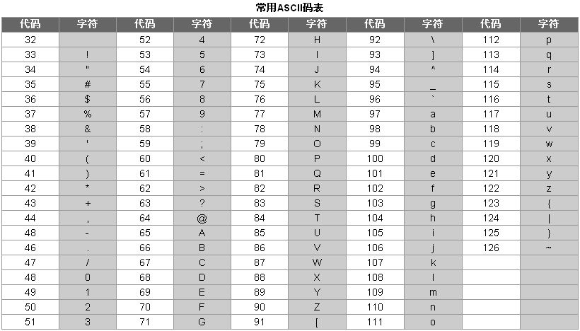

<notice>教程读者请不要直接阅读本文件，因为诸多功能在此无法正常使用，请移步至[程谱 coderecipe.cn](https://coderecipe.cn/learn/2)学习完整教程。如果您喜欢我们的教程，请在右上角给我们一个“Star”，谢谢您的支持！</notice>
变量和类型
======

🌟你已经到到第二章啦，继续加油吧~

变量的定义、赋值和读取
------
变量(variable)，就是可以改变的量，例如在程序运行的一开始这个量是1，后面可以变为2，到程序运行结束的时候可以变为100。在计算机中，我们可以把各种类型的数据（如一个数字、一个字符串）存储在变量中。我们就需要知道变量的几个最基本的用法——定义、赋值、读取和操作。

定义主要是为了明确这个变量在哪里可以被访问到（作用域）和变量的类型。而赋值就是给变量存一个值，比如我们把100存入一个变量（称为`a`），那么`a`里面就存着100这个数字。读取（或说取值）相当于把这个值从变量里面取出来，如果我们取刚才所存的`a`变量，会得到一个100。

定义一个字符串类型变量a的语句如下：
```java
String text;
```
定义其他类型的变量也一样，写法为：
```java
变量类型 变量名;
```
变量的类型在本章中稍后会具体介绍。

给一个字符串变量赋值`"Hello Java!"`的语句如下：
```java
text = "Hello Java!";
```

前面的这两个语句可以合起来，成为：
```java
String text = "Hello Java!";
```

最后读取一个变量的方式就是直接写这个变量的名字，比如下面这条语句可以把`text`读取出来赋值给`abc`：
```java
String abc = text;
```

如果我们定义了变量而没有对其进行赋值（也叫初始化，initialization），那么会发生几种情况，这要看变量定义的位置和类型分类而定，具体我们会在面向对象型编程教程里面讲到。

像在第一章的例子，我们就可以先把字符串存入一个变量，再通过读取这个变量的方式把字符串输出出来，就像下面这样：

<lab lang="java" parameters="filename=Hello.java">
<notice>练习环境在此无法显示，请移步至[程谱 coderecipe.cn](https://coderecipe.cn/learn/2)查看。</notice>
public class Hello {
  public static void main(String[] args) {
      String text = "Hello Java!"; // 定义变量text并赋值
      System.out.println(text); // 读取并输出变量text
  }
}
</lab>

操作也同样简单，例如对于字符串，最简单的操作就是连接两个字符串了，我们使用连接运算符（`+`）来做到这点：
<lab lang="java" parameters="filename=Hello.java">
<notice>练习环境在此无法显示，请移步至[程谱 coderecipe.cn](https://coderecipe.cn/learn/2)查看。</notice>
public class Hello {
  public static void main(String[] args) {
      String str1 = "Hello ";
      String str2 = "Java!";
      System.out.println(str1 + str2); // 连接str1和str2并输出
  }
}
</lab>

给变量起名字
------
无论是在考试还是在实际操作中，变量的命名都是很重要的。一般我们用这4条规则来给变量起名：
1. 变量名称需要有描述性，比如（`string`这种变量名就没有准确描述存储的内容）
2. 如果要描述内容的名称只有一个单词，那么这个变量名可以用这个单词的全小写形式（如`number`），如果名称由两个或两个以上个单词组成，那么变量名为第一个单词首字母小写，剩下的单词紧跟着第一个单词，但第一个字母大写（如学生数量为`studentNumber`）
3. 在变量名中，第一个位置不能是数字（如不能以`1Hello`作为变量名），同时变量名不能有空格，不能有“-”、“/”等对计算机来说有歧义的符号（如`abc*def`会被计算机理解成abc乘以def）
4. 在Java中，变量不能是系统保留用的关键字（比如`class`、`static`）

类型及储存方式
------
### 整数类型（简称整型, int）
在计算机中，整数是以二进制形式储存的，也就是说当我们往Java里储存十进制的`2`时，Java实际上存储的是二进制的`10`。一个二进制的`0`或`1`称为一个比特（bit），8个比特为一个字节（byte）。而Java的`int`由32个bit组成，所以可以有`2^32`（2的32次方）种状态，因为还需要存储负数，因此可以存储`-2^31`到`2^31-1`之间的数。

<!-- TODO: 补充进制转换 -->

### 浮点类型 （double）
浮点类型可以对应我们一般称的“小数”，同样也是通过二进制储存的，只不过并不是像整数那样直接储存，而是使用了科学计数法。

`符号 * 有效位数 * 2 ^ 指数`

比如如果储存的是正号、有效位数转换为十进制是11，指数是-1，那么经过计算我们可以发现这样表现的数字是5.5。

浮点类型除了可以表示小数以外，还可以表示数字无效（`NaN`, Not a Number），或者正负无穷（`Infinity`和`-Infinity`）。比如如下的运算会产生一个`NaN`：
<lab lang="java" parameters="filename=Hello.java">
<notice>练习环境在此无法显示，请移步至[程谱 coderecipe.cn](https://coderecipe.cn/learn/2)查看。</notice>
public class Hello {
  public static void main(String[] args) {
      System.out.println(0.0/0.0);
  }
}
</lab>

注意到使用的`0.0/0.0`了吗，为什么不使用`0/0`呢，看了在下面的“运算和操作符”，你就明白了。

使用浮点类型要注意的一点是要小心精度错误，因为不是所有数字都可以用浮点类型精确表示的，比如如下操作：
<lab lang="java" parameters="filename=Hello.java">
<notice>练习环境在此无法显示，请移步至[程谱 coderecipe.cn](https://coderecipe.cn/learn/2)查看。</notice>
public class Hello {
  public static void main(String[] args) {
      System.out.println(0.1+0.1+0.1);
  }
}
</lab>

我们会发现这个运算的结果不是`0.3`，而是`0.30000000000000004`，这是因为在运算中出现了精度取舍错误（round-off error），如果我们把这个运算和`0.3`比较的话，计算机会告诉我们这两个数字不相等，这在一些操作中是会出现错误的，因此如果我们需要比较两个浮点数是否相等，可以比较两个数的差的绝对值，如果这个绝对值很小（如小于`0.000000001`），就认为这两个数是相等的。

在Java里，double本身的意思是双精度浮点类型，当然也有精度低一些的单精度浮点类型float，在AP考试中，只有双精度浮点类型会被考到，而在实际生活中，可以根据需要使用这两个类型。

### 字符串类型 （String）
字符串类型储存的是一串文字，之前提到的`"Hello Java!"`本质上就属于字符串类型。字符串的储存方式是把每个字符通过一张叫ASCII码表的转换表对应成数字，再把数字一个一个地按顺序储存起来。

ASCII码表长这样：


### 布尔类型 （boolean）
布尔类型是一种特殊的类型，只有两种取值，一种是真（`true`），一种是假（`false`）。它主要有两种用途：
1. 用来记录一个属性的是或者不是，例如记录一个人是不是会员，就可以用布尔型变量`isVIP`来记录
2. 布尔是几个操作符的结果类型，比如比较变量`a`是不是等于变量`b`，结果就是一个布尔类型的值，它有可能为真（相等），也有可能为假（不相等）

运算和操作符
------
说了这么多种类型，那么现在我们来看一下怎么用它们来运算。

### 整数运算
整数运算比较容易理解，像加减乘除都属于整数运算。

<lab lang="java" parameters="filename=Hello.java">
<notice>练习环境在此无法显示，请移步至[程谱 coderecipe.cn](https://coderecipe.cn/learn/2)查看。</notice>
public class Hello {
  public static void main(String[] args) {
      // 在这里输入代码
      System.out.println(888+999);
      System.out.println(888*999);
      System.out.println(888-999);
      System.out.println(10/2);
      System.out.println(888/999);
      System.out.println(10%3);
      System.out.println(0/0);
  }
}
</lab>

**注意**：在Java里乘方不是`^`符号，而是需要通过`Math.pow`来使用，`^`是位运算的异或，比较少用到

你可能会奇怪，`10/2`是5没错，可为什么`888/999`的结果会是0呢？这是因为计算机看到888是整数，而999也是整数，那么就对此进行整数运算，整数的加法、减法和乘法都体现不出来，只有除法会有差别，整数除法后的结果可以理解为算数除法舍去小数点后的部分的结果。

最后的`10%3`进行的是除余运算，10除以3等于3余1，因此这个运算的结果为1。

最后的`0/0`运算会报一个`java.lang.ArithmeticException`的错误，**因为一个数除以`0`没有定义，而整数下不能表示`NaN`**，这种运行时报错叫做“异常（exception）”，在[“异常”](https://coderecipe.cn/learn/2?chapter=5)一章中我们会讲到。不过需要注意的是，浮点数可以表示`NaN`（参见[类型及储存方式](https://coderecipe.cn/learn/2?chapter=1#section-%E7%B1%BB%E5%9E%8B%E5%8F%8A%E5%82%A8%E5%AD%98%E6%96%B9%E5%BC%8F)），因此`0.0/0.0`结果会是`NaN`而不会报错。

### 浮点运算
浮点运算同样也是用类似的方法调用：
<lab lang="java" parameters="filename=Hello.java">
<notice>练习环境在此无法显示，请移步至[程谱 coderecipe.cn](https://coderecipe.cn/learn/2)查看。</notice>
public class Hello {
  public static void main(String[] args) {
      // 在这里输入代码
      System.out.println(99.1+0.9);
      System.out.println(99.1*99.9);
      System.out.println(100-0.9);
      System.out.println(888.0/999);
      System.out.println(10.2%5);
  }
}
</lab>

这里和上面的差别在于，两个操作数（可以理解为参与运算的数字）至少有一个是浮点类型的。最后一个操作和前面的`888/999`不同，我们在`888`后面加了一个`.0`，使其变成了一个浮点数。因为`888.0`是浮点类型，尽管`999`是整型，计算机也会使用浮点运算，结果自然就是一个浮点数了。

你可能会问，计算机为什么不都用浮点类型进行运算呢，这是因为很多时候程序不需要浮点运算的结果，而进行整型运算会比浮点运算快得多。

浮点的除余运算，除了用`10.2-2*5`理解方式（其中的2是`10.2/5`的整数部分），还可以理解为用`10.2`去反复减去`5`，直到得到一个小于5的数为止（`10.2-5=5.2 5.2-5=0.2`），因此结果为0.2。

整数运算和浮点运算统称算术运算。

**注意**：别忘了浮点运算可能有精度取舍错误。

### 类型转换
如果我们有两个`int`类型的变量，想要让他们进行浮点运算，要怎么做呢？毕竟变量可不能在后面加`.0`。这时候就需要用到类型转换了。就像下面这样：
<lab lang="java" parameters="filename=Hello.java">
<notice>练习环境在此无法显示，请移步至[程谱 coderecipe.cn](https://coderecipe.cn/learn/2)查看。</notice>
public class Hello {
  public static void main(String[] args) {
      // 在这里输入代码
      System.out.println((double)888/999);
  }
}
</lab>

在整型前面加上`(double)`，我们就成功把它转化为了一个浮点类型的数字。当然把浮点类型转化为整型也是一样，只需要在前面加上`(int)`即可，不过要小心丢失小数点后面的内容：
<lab lang="java" parameters="filename=Hello.java">
<notice>练习环境在此无法显示，请移步至[程谱 coderecipe.cn](https://coderecipe.cn/learn/2)查看。</notice>
public class Hello {
  public static void main(String[] args) {
      // 在这里输入代码
      System.out.println((int)888.9);
  }
}
</lab>

**注意**：这里的转化，和整数除法的结果一样，是直接丢失小数点后面的内容而不是进行四舍五入。

类型转换本质上也是一种运算，只不过运算的结果和输入给运算的值类型不同而已。

### 关系运算

关系运算判断的是两个操作数的关系，主要有：

| 运算符 | 含义 |
| - | - |
| `>` | 大于 |
| `<` | 小于 |
| `>=` | 大于等于 |
| `<=` | 小于等于 |
| `==` | 等于 |
| `!=` | 不等于 |

这里的`==`和前面提到的赋值运算符`=`不一样，前者是判断是否相等，后者是把一个值赋给变量用的。关系运算符返回一个布尔类型的数值，如果关系是正确的（比如`5==5`），那么返回真（`true`），如果关系是错误的（比如`5==6`），那么返回假（`false`）。

### 逻辑运算

关系运算判断的是布尔值本身或者布尔值之间的关系，主要有：

| 运算符 | 含义 |
| - | - |
| && | 与 |
| &#124;&#124; | 或 |
| ! | 非 |

与需要左右两边都为真才返回真，或只需要一边为真即可，非只需要右边的一个操作数，会反过来输出（操作数为真输出假，操作数为假输出真）。
<lab lang="java" parameters="filename=Hello.java">
<notice>练习环境在此无法显示，请移步至[程谱 coderecipe.cn](https://coderecipe.cn/learn/2)查看。</notice>
public class Hello {
  public static void main(String[] args) {
      // 在这里输入代码
      System.out.println(true&&true);
      System.out.println(false||true);
      System.out.println(!false);
  }
}
</lab>

逻辑运算符常常和关系运算符一起用：
<lab lang="java" parameters="filename=Hello.java">
<notice>练习环境在此无法显示，请移步至[程谱 coderecipe.cn](https://coderecipe.cn/learn/2)查看。</notice>
public class Hello {
  public static void main(String[] args) {
      // 在这里输入代码
      System.out.println((3>2)&&(2>1));
  }
}
</lab>

### 赋值运算和增减量运算

赋值运算符由最基本的`=`运算符和复合赋值运算符组成：

| 运算符 | 含义 |
| - | - |
| `=` | 赋值 |
| `+=` | 加上 |
| `-=` | 减去 |
| `*=` | 乘上 |
| `/=` | 除去 |
| `%=` | 进行除余赋值运算 |
| `++` | 增量运算，与`+=1`等价 |
| `--` | 减量运算，与`-=1`等价 |

一个复合运算符可以看成算术运算符加上赋值运算符，如下面的`a+=1`运算等价于`a=a+1`：
<lab lang="java" parameters="filename=Hello.java">
<notice>练习环境在此无法显示，请移步至[程谱 coderecipe.cn](https://coderecipe.cn/learn/2)查看。</notice>
public class Hello {
  public static void main(String[] args) {
      // 在这里输入代码
      int a = 1;
      a+=1;
      System.out.println(a);
  }
}
</lab>

### 其他运算
在Java里还有很多其他的运算符，例如位运算是用来处理位与位的关系的，日常用途中比较少用，`.`运算符在讲到类的时候会说到，再其他的运算符就更少用到了。

### 优先级
有这么多的的运算关系，该怎么确定它们之间的优先级就是一个非常重要的问题。Java中的算数优先级和数学大抵相同，先乘除后加减：

1. 算数运算的优先级如下，优先级从高往低排列：
```
a) 括号，从内层开始

b) * , /, %

c) + , -
```
2. 总体优先级如下，优先级从高往低排列
```
a) ()

b) ! , ++ , -

c) * , / , %

d) + , -

e) < , > , <= , >=

f) == , !=

g) &&

h) ||

i) = , += , -= *= , /= , %=
```
这些看起来很复杂，实际上是比较符合我们的数学常识的。大家可以在理解中记忆，练习时不确定来查即可。

标识符
------
通俗地说，标识符其实就是变量、方法和类等的名字。在同一个作用域（可以调用的范围）内，不允许有两个变量有同样的标识符。像这样就是不行的：
<lab lang="java" parameters="filename=Hello.java">
<notice>练习环境在此无法显示，请移步至[程谱 coderecipe.cn](https://coderecipe.cn/learn/2)查看。</notice>
public class Hello {
  public static void main(String[] args) {
      int a = 1;
      int a = 2;
  }
}
</lab>

注意：对于标识符的概念，不要简单地理解成重名就一定不能共存，比如这样是可以的：
<lab lang="java" parameters="filename=Hello.java">
<notice>练习环境在此无法显示，请移步至[程谱 coderecipe.cn](https://coderecipe.cn/learn/2)查看。</notice>
public class Hello {
  int a = 1;
  public static void main(String[] args) {
      int a = 2;
  }
}
</lab>

主要原因是他们的作用域不一样，具体在我们学类的时候会详细说明。

方法的标识符的概念和变量又有一些区别，我们之后会提到。

final变量
------
有的时候，我们需要设定一个值，而这个值会被很多地方引用（比如学生数量），如果直接用数字写在代码里，一旦这个数字需要修改，工程师们就需要查遍所有有可能出现这个数字的地方去改它。而且麻烦在于不能直接用查找和替换，毕竟同一个数字可能有不同的用途（比如我们想改的是学生数量的50，却把一节课的时间50也一起改了）。

有一种替代方法是在开头声明一个变量（如前面说的studentNum），之后在需要用到这个数字的时候都引用这个变量而不是直接写数字，比如我们需要两倍于学生数量的笔：
<lab lang="java" parameters="filename=Hello.java">
<notice>练习环境在此无法显示，请移步至[程谱 coderecipe.cn](https://coderecipe.cn/learn/2)查看。</notice>
public class Hello {
  public static void main(String[] args) {
      int studentNum = 50;
      System.out.print("Number of pens: ");
      System.out.println(studentNum * 2);
      // 而不是 System.out.println(50 * 2);
  }
}
</lab>

但这样有一个问题，Java不知道我们是不是要修改这个变量，因此很难做优化，并且要是我们操作出错修改了这个变量，那整个程序都会出现严重的问题：
<lab lang="java" parameters="filename=Hello.java">
<notice>练习环境在此无法显示，请移步至[程谱 coderecipe.cn](https://coderecipe.cn/learn/2)查看。</notice>
public class Hello {
  public static void main(String[] args) {
      int studentNum = 50;
      studentNum = 30; // 一个错误的操作
      System.out.print("Number of pens: ");
      System.out.println(studentNum * 2);
      // 100 才应该是正确的结果
  }
}
</lab>

因此Java给我们提供了`final`这个关键字（注意关键字是不能当变量名的），用来定义`final`变量（final variable， 也叫用户定义常量，即user-defined constant）。

<lab lang="java" parameters="filename=Hello.java">
<notice>练习环境在此无法显示，请移步至[程谱 coderecipe.cn](https://coderecipe.cn/learn/2)查看。</notice>
public class Hello {
  public static void main(String[] args) {
      final int STUDENT_NUM = 50;
      // STUDENT_NUM = 30;
      System.out.print("Number of pens: ");
      System.out.println(STUDENT_NUM * 2);
      // 100是正确的结果
  }
}
</lab>

与变量的命名惯例不同，常量一般都需要大写，并且词和词之间多用`_`连接。

去除注释以后，我们会发现出现了以下错误：
```
Hello.java:5: error: cannot assign a value to final variable STUDENT_NUM
```
这就防止了我们无意中对final变量进行修改。

**注意**：`final`变量并不一定要在定义的时候赋值，你也可以把上面的`final int STUDENT_NUM = 50;`拆成`final int STUDENT_NUM;`和 `STUDENT_NUM = 50;`，甚至可以把赋值语句放在条件语句里（下一章会学到）有条件地执行，但一定要注意不能第二次赋值，也不能不赋值就读取。


小练习
------
让我们来练习一下我们刚学习的知识吧。
<lab lang="java" parameters="filename=Hello.java">
<notice>练习环境在此无法显示，请移步至[程谱 coderecipe.cn](https://coderecipe.cn/learn/2)查看。</notice>
public class Hello {
  public static void main(String[] args) {
      // 在这里输入代码
  }
}
</lab>

试试做出如下的效果：

1. 计算100+998/12（要保留小数位后的数字，答案为183.16666666666669）
2. 判断100/10是否等于10
3. 建立一个整型变量`a`并赋值为10，对其加一，然后输出`a`。

学到这里，你就已经把第二章全部学完啦，给你鼓鼓掌👏👏👏~
