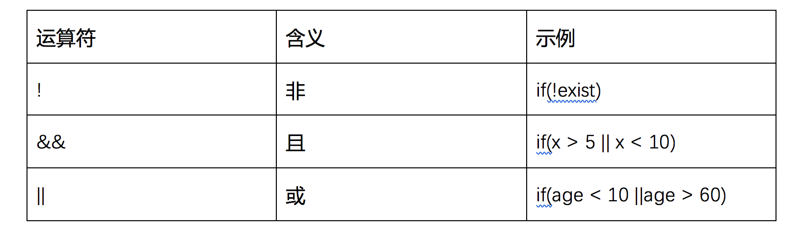

<notice>教程读者请不要直接阅读本文件，因为诸多功能在此无法正常使用，请移步至[程谱 coderecipe.cn](https://coderecipe.cn/learn/2)学习完整教程。如果您喜欢我们的教程，请在右上角给我们一个“Star”，谢谢您的支持！</notice>
if语句——选择判断
======

🌟你已经到到第三章啦，继续加油吧~

如果…否则如果…否则…
------
if语句，是Java逻辑中最简单和最常用的一种。它的意义是，当某个条件成立时，执行某个操作；当这个条件不成立时，执行另外一个操作。具体的代码如下：
```java
if(条件){
···
//如果条件为真，则执行
}else{
···
//如果条件为假，则执行
}
```
比如某个酒类售卖网站需要根据使用者的年龄信息进行操作。只有在用户的年龄大于等于21岁时，才可以使用。那么他们的代码应该这么写：

e.g.
```java
int age = 18;//可以改变这个数值
if(age < 21){
  System.out.println("You are not eligible to use this service.");
}else{
  System.out.println("You are welcome to use this service.");
}
```
上方就是一个最简单的判断语句的使用方式，如果age变量小于21，则执行上方的代码，显示“You are not eligible to use this service.”，不然就执行下方的代码，显示“You are welcome to use this service.”。

且、或和非
-----
且、或和非统称为逻辑运算符，和上一章介绍的关系运算符一样，都是一种运算符。“且”要求两个陈述同时成立，“或”要求两个陈述至少成立一个，而“非”就是将布尔值转换，把真的变成假的，假的变成真的。在Java语言中它们如下图所示：


非 e.g.

当文件找不到时exist变量的值会是false，此时如果想执行代码可以使用
```java
if(!exist){
  ...
}
```
这段代码等效于下面的代码：
```java
if(exist){
  ...
}
else{
  ...
}
```
且 e.g.
```java
if(a && b){
...
}
```
这段代码等效于下面的代码：
```java
if(a){
	if(b){
    ...
  }
}
```
或 e.g.
```java
if(a || b){
  ...
}
```
这段代码等效于下面的代码（例外是，如果`a`和`b`都是`true`这个代码不会执行两次，只会执行一次）：
```java
if(a){
  ...
}
if(b){
  ...
}
```
大家也可以在下面的lab中尝试一下，修改其中的逻辑运算符，来感受一下其中的差别。
<lab lang="java" parameters="filename=Hello.java">
<notice>练习环境在此无法显示，请移步至[程谱 coderecipe.cn](https://coderecipe.cn/learn/2)查看。</notice>
public class Hello {
  public static void main(String[] args) {
      boolean a = true;
      boolean b = false;
      if(a || b){
        System.out.println("aaa");
      }
      else{
        System.out.println("bbb");
      }
  }
}
</lab>

最小化求值原理
-----
使用电脑的人总是希望电脑可以很快完成任务，设计电脑的工程师当然也是这样想的。因此计算机程序再运行的时候会自动排除一些不可能发生的情况，从而让电脑少算一些值来加快电脑运行的速度。

比如我们的程序需要判断100是不是等于200并且200是不是等于200，计算机在运算的时候，首先判断100是否等于200，当它发现100已经不等于200的时候，无论后面200是不是等于200，这整个判断都不可能是正确的。因此计算机就跳过了后面的判断，直接以这个判断的结果为不正确来处理。

同样，当我们的程序需要判断100是不是等于100或者200是不是等于300，计算机在运算的时候，首先看100是不是等于100，发现是的，那么无论后面200是不是等于300，整个判断都是对的，因此计算机也跳过了后面的判断，直接以这个判断的结果为正确来处理。

这个最小化求值原理看起来是计算机内部的一个小把戏，可有的时候也会影响到我们程序的运行。

比如当我们程序是这样的时候，无论第二个条件“200 == 200”怎么改变，是不是正确的，都不会改变程序最后输出“No”的事实：
```Java
int a = 100;
if(a == 200 || 200 == 200){
  System.out.println("Yes");
}
else{
  System.out.println("No");
}
```
请在lab中试一下这个神奇的功能吧！
<lab lang="java" parameters="filename=Hello.java">
<notice>练习环境在此无法显示，请移步至[程谱 coderecipe.cn](https://coderecipe.cn/learn/2)查看。</notice>
public class Hello {
  public static void main(String[] args) {
    int a = 100;
    if(a == 200 || 200 == 200){
      System.out.println("a");
    }
    else{
      System.out.println("b");
    }
    if(a == 200 && 200 == 200){
      System.out.println("c");
    }
    else{
      System.out.println("d");
    }
  }
}
</lab>

德摩根定律
-----
在计算机里，德摩根定律表示的是两种等价关系：
* `!a && !b <=> !(a || b)`
* `!a || !b <=> !(a && b)`
其中，`<=>`意味着等价，`a`和`b`都是布尔值。

例如，当`a`和`b`都是`true`时，我们看定律中的第一条：

`!a && !b = !true && !true = false && false = false`

`!(a || b) = !(true || true) = !true = false`

两者的值是一样的。

当`a`和`b`都是`true`时，我们看定律中的第二条：

`!a || !b = !true || !true = false || false = false`

`!(a && b) = !(true && true) = !true = false`

两者的值是也一样的。

小练习
-----
1. What will be output by the following statement?
```java
int age = 1;
if(age > 10){
	System.out.println(age);
}
```
(A)1

(B)10

(C)no output

(D)unknown

下面的内容要按一下才会显示：
<cr type="hidden"><notice>隐藏内容功能在此无法正常显示，请移步至[程谱 coderecipe.cn](https://coderecipe.cn/learn/2)查看。</notice>C</cr>

2. What will be output by the following statement?
```java
int i = 7;
if(i>0)
  if(i%2 == 0)
    System.out.println(i);
  else
    System.out.println(i+" is not positive");
    ```
(A)7

(B)1

(C)no output

(D)7 is not positive

下面的内容要按一下才会显示：
<cr type="hidden"><notice>隐藏内容功能在此无法正常显示，请移步至[程谱 coderecipe.cn](https://coderecipe.cn/learn/2)查看。</notice>D</cr>
