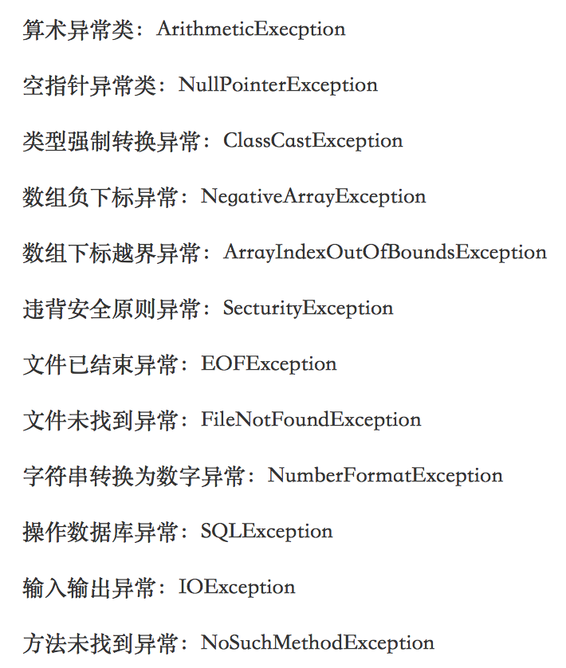

<notice>教程读者请不要直接阅读本文件，因为诸多功能在此无法正常使用，请移步至[程谱 coderecipe.cn](https://coderecipe.cn/learn/2)学习完整教程。如果您喜欢我们的教程，请在右上角给我们一个“Star”，谢谢您的支持！</notice>
异常
======
🌟你已经到到第六章啦，继续加油吧~

发生异常的情况
-----
在我们运行Java程序时，有可能会出现一些**异常**（exception）。异常是一种Java程序在执行过程中抛出的错误情况。比如计算机运算出`1/0`就会抛出`ArithmeticException`（但**注意**浮点运算`1.0/0`不会抛出异常，而会得到`NaN`作为结果），如果拿了负数作为Array的index，那么就会抛出`ArrayIndexOutOfBoundsException`异常。

异常分为两种，被捕捉（catch）住的和没有被捕捉住的。如果是没有捕捉住的异常就是unchecked exception，也就是说写代码的人没有设计如何处理这个异常，这样可能就会导致程序停止运行。这时候，你就需要认真检查你写的代码，并进行修改了。

还有一种就是被捕捉住的异常，也就是checked exception，这类异常会得到处理，危害就没有上述的那么大，checked exception不在AP范围内。

异常同样可以分为运行异常类（RuntimeException）和非运行异常类（Non-RuntimeException）这两个直接的子类。其中前者出现频率较高，并且可以出现在任何地方，不一定能被catch。后者一般都可以被检测出来。在Java的标准包java.lang, java.util 和 java.net 中定义的异常都是非运行异常。

需要掌握的异常
-----
在Java中，有非常非常多的异常，而查证这些异常的方法更是一门很深的学问。由于AP考试并不要求，在此也略为不表。大家只需要记住我们常用的一些异常即可。这些异常大多以英文单词拼成，十分好理解。大家如果没有明白，我们也选择了常考的异常配备了中文翻译，方便大家查找和复习：

以上就是我们需要掌握的异常了，我们不需要知道用throw方法抛出异常，但是需要知道这些异常产生的原因以及什么时候会抛出异常。

小练习
------
1. 当计算了`1/0`，会发生什么结果？

a. `ArithmeticException`异常

b. `ArrayIndexOutOfBoundsException`异常

c. 运行错误

d. 返回`NaN`
